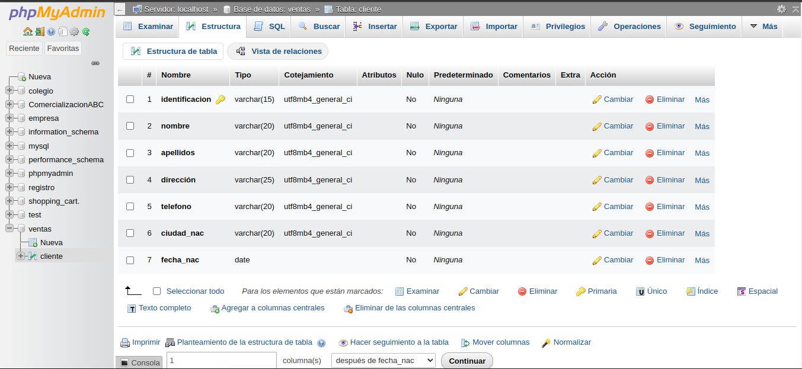
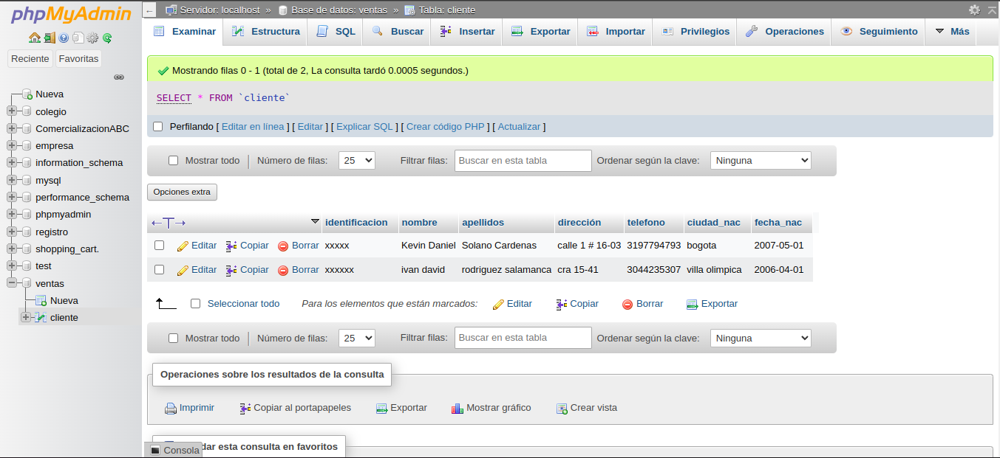

# INTRODUCCION A SQL

1. creacion de una base de dtos (BD) con MySQL usando phpMyAdmin

### diccionario de datos
|campo|tipo de datos|longitud|
|-----|-------------|--------|
|indentificacion|varchar|15|
|nombre|varchar|20|
|apellidos|varchar|20|
|dirreccion|varchar|25|
|telefono|varchar|20|
|ciudad_nac|varchar|20|
|fecha_nac|date||

### codigo de creacion 
CREATE TABLE `Ventas`.`Cliente` (`identificacion` VARCHAR(15) NOT NULL , `nombre` VARCHAR(20) NOT NULL , `apellidos` VARCHAR(20) NOT NULL , `direccion` VARCHAR(25) NOT NULL , `telefono` VARCHAR(20) NOT NULL , `ciudad_nac` VARCHAR(20) NOT NULL , `fecha_nac` DATE NOT NULL , PRIMARY KEY (`identificacion`)) ENGINE = InnoDB;

### registro de datos en tabla clientes

#### codigo SQL de insercion de un registro a la tabla cliente

INSERT INTO `cliente` (`identificacion`, `nombre`, `apellidos`, `dirección`, `telefono`, `ciudad_nac`, `fecha_nac`) VALUES ('xxxxx', 'Kevin Daniel', 'Solano Cardenas', 'calle 1 # 16-03', '3197794793', 'bogota', '2007-05-01');

